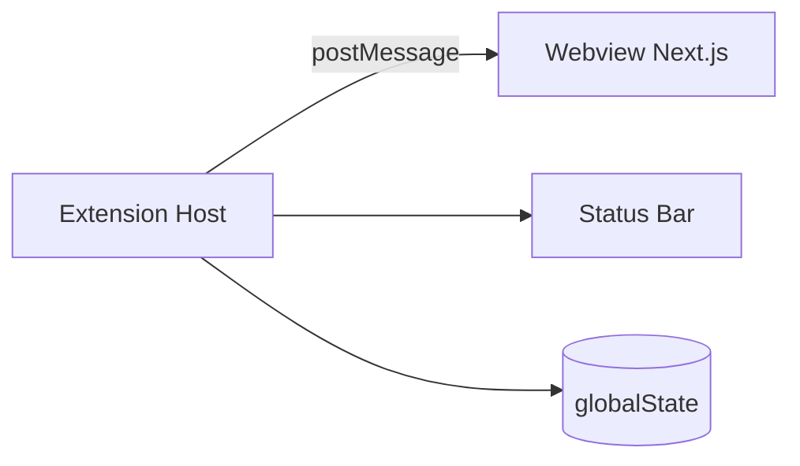

# CodePulse

> VS Code being open does **not** mean the user is coding.

CodePulse is a lightweight, beautiful, and reliable developer-productivity extension for **VS Code** and **Cursor** that tracks **genuine active coding time** — not mere IDE uptime — and turns it into sessions, combos, daily goals and streaks.

- Local-first. No accounts. No telemetry. No source-code collection.
- Minimal, IDE-native UI built with TypeScript, Tailwind and Next.js.
- Designed to feel believable: opening the editor and walking away shows `00:00:00`.

---

## Why CodePulse exists

Most "time tracker" extensions count the wall-clock minutes VS Code was open. That isn't useful — and it isn't true.

CodePulse measures **activity**: typing, moving the cursor, switching files, scrolling, saving. When activity stops, the timer pauses. When activity resumes, it resumes. When you've been away for long enough, the session ends.

The result is a coding-time number you'd be willing to defend.

---

## Core features (V1)

- ⚡ **Active Coding Timer** — `IDLE / ACTIVE / PAUSED`, with a configurable idle threshold.
- 🧠 **Coding Sessions** — every focused period captured with duration and stats.
- 🔥 **Time-based Combo** — multiplier that grows with continuous active minutes.
- 🎯 **Daily Goal** — configurable target with progress and a single completion notification.
- 🔁 **Streaks** — consecutive days that hit your minimum.
- 🪟 **Status Bar** — compact `⚡ 01:42:18` always visible.
- 📊 **Sidebar Dashboard** — premium minimal UI built in Next.js.

---

## Screenshots

> Placeholders — replace once the UI is built.

| Sidebar | Status Bar |
| --- | --- |
|  |  |

---

## How it works (one paragraph)

The extension host subscribes to editor events, debounces them into a single activity signal, and feeds them into a small set of pure engines: a timer, a session manager, a combo engine, a streak engine and a goal engine. Engines persist a versioned, validated blob into VS Code's `globalState`. A throttled snapshot is sent over a message bridge to a Next.js webview, which renders the sidebar dashboard and the status bar item. There is no server, no telemetry, no source-code access.

Read [`docs/HLD.md`](docs/HLD.md) for the architecture and [`docs/ACTIVITY_DETECTION.md`](docs/ACTIVITY_DETECTION.md) for the most important part: what counts as activity.

---

## Architecture overview



- [`docs/REQUIREMENTS.md`](docs/REQUIREMENTS.md) — what we're building.
- [`docs/HLD.md`](docs/HLD.md) — high-level design.
- [`docs/ARCHITECTURE.md`](docs/ARCHITECTURE.md) — modules and layering.
- [`docs/LLD.md`](docs/LLD.md) — implementation-oriented design.
- [`docs/DATA_MODEL.md`](docs/DATA_MODEL.md) — persisted schema.
- [`docs/ACTIVITY_DETECTION.md`](docs/ACTIVITY_DETECTION.md) — what counts.
- [`docs/UI_SPECIFICATION.md`](docs/UI_SPECIFICATION.md) — every UI surface.
- [`docs/TESTING.md`](docs/TESTING.md) — test strategy and edge cases.
- [`docs/SECURITY.md`](docs/SECURITY.md) — privacy posture.
- [`docs/FUTURE_ROADMAP.md`](docs/FUTURE_ROADMAP.md) — V2 / V3 ideas.

---

## Tech stack

- **TypeScript** (strict) for both the extension and the UI.
- **VS Code Extension API** (works in Cursor).
- **Next.js** for the sidebar webview (static export).
- **Tailwind CSS** for styling.
- **Vitest** + `@vscode/test-electron` for tests.

---

## Installation

> V1 is not yet published. The instructions below describe the developer workflow that produces a local `.vsix`.

1. Clone the repository.
2. Install dependencies (`npm install`).
3. Build the UI (`npm run build:webview`).
4. Package the extension (`npm run package`).
5. Install the resulting `.vsix`:
   - VS Code: `Extensions → ... → Install from VSIX…`
   - Cursor: same flow.

---

## Development setup

```bash
git clone <repo>
cd codepulse
npm install
npm run build:webview   # build the Next.js webview
npm run watch           # tsc watch the extension
```

To launch the extension in a sandboxed editor:

```bash
npm run dev   # opens Extension Development Host with the extension loaded
```

### Build

```bash
npm run build
```

### Test

```bash
npm run test:unit
npm run test:integration   # slower; uses vscode-test
```

### Lint / format

```bash
npm run lint
npm run format
```

### Package

```bash
npm run package   # produces codepulse-<version>.vsix
```

---

## Compatibility

- **VS Code**: stable channel, recent versions.
- **Cursor**: stable channel. CodePulse avoids proposed APIs and VS-Code-only extensions to the API. Differences are documented in [`docs/ACTIVITY_DETECTION.md`](docs/ACTIVITY_DETECTION.md) § 15.

---

## Privacy

CodePulse does not transmit source code, file contents, keystrokes, or any data off your machine. All metrics are computed and stored locally in VS Code's `globalState`. There is no telemetry in V1. See [`docs/SECURITY.md`](docs/SECURITY.md) for the full posture.

---

## Roadmap

V1 focuses on the core: active coding time, sessions, combo, daily goal, streak.

V2 adds deeper insights (weekly dashboards, languages, projects) and export.

V3 adds an optional cloud account and web dashboard for cross-device sync.

All cloud features will be opt-in. See [`docs/FUTURE_ROADMAP.md`](docs/FUTURE_ROADMAP.md).

---

## Contributing

1. Read [`docs/REQUIREMENTS.md`](docs/REQUIREMENTS.md) and the relevant design doc first.
2. Pick an item or open an issue describing the change.
3. Follow the existing module layout (see [`docs/ARCHITECTURE.md`](docs/ARCHITECTURE.md)).
4. Add or update tests (see [`docs/TESTING.md`](docs/TESTING.md)).
5. Update documentation if behaviour changes.

We do not introduce dependencies without justification, and we do not collect source code under any circumstances.

---

## License

TBD.
