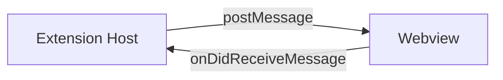
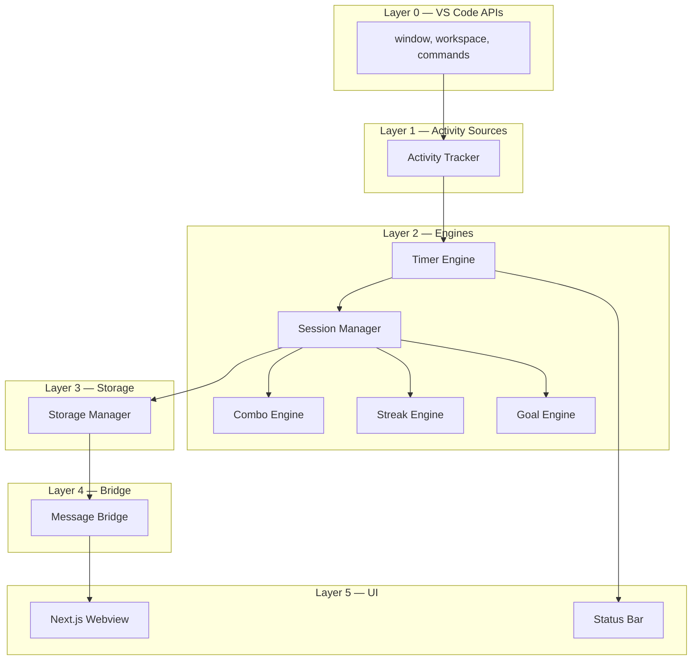

# CodePulse — Architecture

Version: 0.2
Scope: V1

This document is the canonical pointer between the major engineering concerns of CodePulse. It links to specialised docs rather than duplicating them.

---

## 1. Process Topology

CodePulse runs in two cooperating processes:

1. **Extension Host (Node)** — owns all engines, storage and the message bridge.
2. **Webview (Chromium, Next.js UI)** — owns presentation only.

They communicate exclusively through the VS Code message protocol.



The boundary is the only seam. The UI cannot reach into the engine directly. It asks via intents; the engine replies with snapshots.

---

## 2. Module Layout (V1 source tree)

```
codepulse/
├── package.json                # VS Code extension manifest
├── src/
│   ├── extension.ts            # activate() / deactivate()
│   ├── engines/
│   │   ├── activityTracker.ts
│   │   ├── timerEngine.ts
│   │   ├── sessionManager.ts
│   │   ├── comboEngine.ts
│   │   ├── streakEngine.ts
│   │   └── goalEngine.ts
│   ├── storage/
│   │   ├── storageManager.ts
│   │   ├── schema.ts
│   │   └── migrations.ts
│   ├── messaging/
│   │   ├── bridge.ts
│   │   └── protocol.ts         # message type definitions
│   ├── ui/
│   │   ├── sidebarProvider.ts
│   │   └── statusBar.ts
│   ├── notifications/
│   │   └── notifier.ts
│   ├── config/
│   │   └── settings.ts
│   └── util/
│       ├── time.ts
│       ├── id.ts               # ULID generator (no dep)
│       ├── debounce.ts
│       └── logger.ts
├── webview/                    # Next.js app (UI layer)
│   ├── app/
│   ├── components/
│   ├── lib/
│   └── out/                    # static export consumed by bundler
├── docs/                       # this folder
└── tests/
    ├── unit/
    └── integration/
```

The Next.js app produces a static export (`webview/out`) that is bundled into the extension at packaging time.

---

## 3. Layering



Strict downward dependencies. No engine imports from UI. No engine imports from `vscode` directly except where strictly necessary (Activity Tracker is the only place that subscribes to VS Code editor events; everything downstream is editor-agnostic and unit-testable in pure Node).

---

## 4. Data Flow Summary

1. The **Activity Tracker** subscribes to editor events and emits a normalised `signalActivity(now)` pulse.
2. The **Timer Engine** consumes pulses and advances state.
3. The **Session Manager** listens to state transitions and to wall-clock events (midnight, shutdown).
4. The **Storage Manager** persists deltas (debounced).
5. The **Message Bridge** publishes a throttled snapshot to the webview.

Detailed flow diagrams live in `HLD.md`.

---

## 5. State Authority

- The **extension host** is the single source of truth.
- The webview is **stateless and re-renderable**. It may be closed/reopened without data loss.
- The status bar item is driven by the same snapshot as the webview.

---

## 6. Configuration

- All thresholds live in `UserSettings` (see `DATA_MODEL.md`) and are mirrored to VS Code settings under `codepulse.*`.
- The `Settings` module watches `vscode.workspace.onDidChangeConfiguration` and pushes updates into engines.
- Engines re-read settings on each decision; they do not cache values long-term.

---

## 7. Cross-Editor Compatibility

- VS Code and Cursor both implement the standard VS Code Extension API.
- CodePulse shall not depend on `vscode` namespace APIs that are unique to either fork.
- Known divergence points are documented in `ACTIVITY_DETECTION.md` § 10.

---

## 8. Failure Modes

| Failure | Detection | Response |
| --- | --- | --- |
| Corrupted storage | Schema validator fails | Log warning, restore defaults, continue. |
| Webview crash | `onDidDispose` | Engine unaffected; status bar continues. |
| Extension reload | `activate()` re-runs | Rehydrate from storage; do not double-count. |
| Clock skew | `Date.now()` jumps | Engines use monotonic `performance.now()` for durations; wall clock only for boundaries. |
| Clock forward jump | Tick delta spikes | Tick caps delta to 2 s. |
| Storage quota | `globalState.update` throws | Prune oldest daily stats, retry, log. |
| Unknown schemaVersion | `schemaVersion > CURRENT` | Preserve in `codepulse.state.unknownBackup`, defaults, one-time notification. |

---

## 9. Performance Posture

- Activity pulses are debounced (~100 ms) before reaching the timer.
- Snapshots are throttled to 1 Hz.
- The webview renders React state from the latest snapshot only.
- No activity event triggers I/O in the hot path.
- The timer tick halts if the engine is `IDLE` and there are no listeners that need it.

---

## 10. Extension Points (V1)

The following seams are designed for V2+ without breaking V1:

- `StorageManager` interface can be re-implemented against a cloud backend.
- Engines are pure; they can be reused by a desktop / CLI build.
- The webview can be swapped for a different framework as long as the message protocol stays stable.
- Notifier can be swapped (e.g., to a richer toast) without engine changes.
