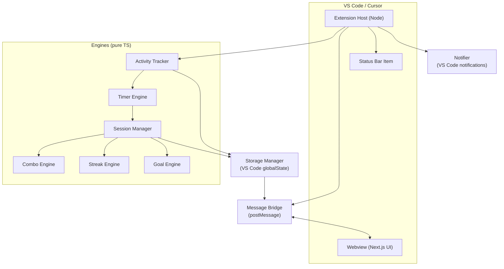
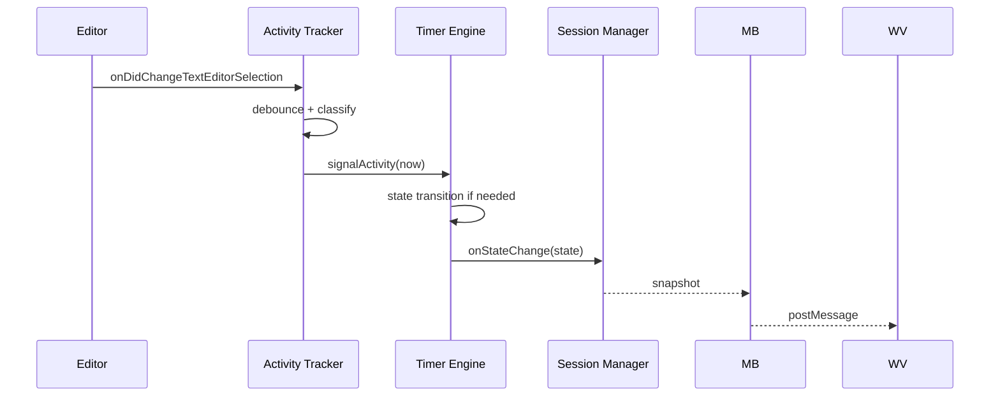
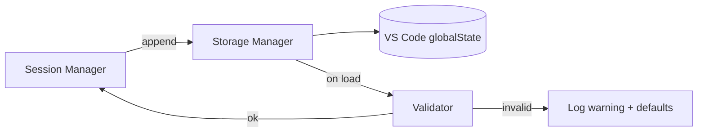
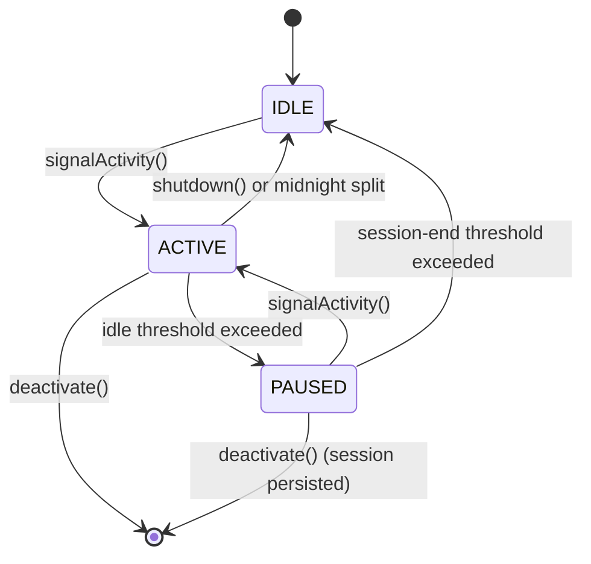
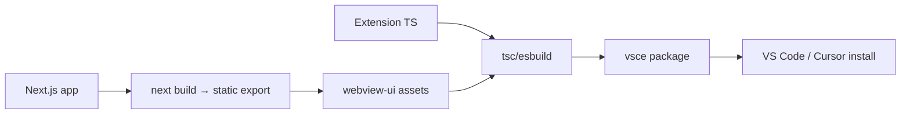

# CodePulse — High-Level Design (HLD)

Version: 0.2
Status: Living document
Scope: V1

---

## 1. Product Overview

CodePulse is a VS Code / Cursor extension that tracks **genuine active coding time** and translates it into meaningful developer metrics: sessions, combos, daily goals and streaks. It is local-first, private by construction, and built to feel premium.

The core promise:

> Open the editor → see zero. Start coding → see time.

## 2. Goals

- Believable, defensible active coding time.
- A clean, minimal, IDE-native UI.
- Local-first storage; zero network for V1.
- Low CPU / memory footprint.
- Strong separation between engine and UI.

## 3. Non-Goals (V1)

- Cloud sync, accounts, telemetry.
- Project-level / language-level analytics.
- AI insights.
- Team features.
- Terminal / debug activity counting.

## 4. Major Technical Decisions

| ID | Decision | Rationale |
| --- | --- | --- |
| AD-1 | Engines as pure TS modules | Testable, framework-free, reusable. |
| AD-2 | Next.js for UI (static export) | Required by spec; output bundled into the webview at build time. |
| AD-3 | Local storage only | Privacy + simplicity; no backend required. |
| AD-4 | Activity events are debounced ~100 ms | Avoid per-keystroke work; protect extension host. |
| AD-5 | Schema-versioned persisted blobs | Future migration safety. |
| AD-6 | Hand-rolled reducer state machine | Explicit transitions, easy to test, no XState dep. |
| AD-7 | Message bridge is the only UI ↔ engine channel | Clean boundary, no leaky abstractions. |
| AD-8 | Monotonic time for durations, wall time for boundaries | Clock skew during ACTIVE is harmless. |
| AD-9 | Single storage key, single JSON blob | Simpler validation, simpler migration, smaller surface. |
| AD-10 | Sidebar webview is stateless re renderer | It may close/reopen without data loss. |

## 5. System Architecture

CodePulse runs in two cooperating processes: the **extension host** (Node) and the **webview** (browser-like). The engine lives in the extension host. The UI lives in the webview. They communicate over the VS Code message protocol.

### 5.1 Component Responsibilities

| Component | Responsibility |
| --- | --- |
| **Activity Tracker** | Subscribe to editor events, normalise them into a single debounced activity signal. |
| **Timer Engine** | Maintain `IDLE/ACTIVE/PAUSED`, advance `activeMillis` on tick. |
| **Session Manager** | Open/close sessions, write to daily stats, orchestrate combo / goal / streak. |
| **Combo Engine** | Compute combo multiplier from current session active duration. |
| **Streak Engine** | Compute current streak from daily stats. |
| **Goal Engine** | Track today's progress vs configured daily goal. |
| **Storage Manager** | Read/write/validate persisted blobs with schema versioning. |
| **Message Bridge** | Serialise engine state into webview messages and vice versa. |
| **Notifier** | Show VS Code notifications for milestones, throttled. |
| **Status Bar Item** | Render compact `⚡ 01:42:18` view. |
| **Sidebar Webview** | Render the dashboard. |

## 6. Data Flow

### 6.1 Activity → Timer

### 6.2 Persistence

## 7. State Transitions

## 8. Extension ↔ Webview Communication

- **Outbound (engine → UI)**: throttled snapshots, max 1 Hz. Messages typed as `CpSnapshot`, `CpNotification`.
- **Inbound (UI → engine)**: intents, e.g. `CpSetGoal`, `CpSetStreakMinimum`, `CpRequestSnapshot`. All intents are validated server-side; the UI never has authority over state — it asks.
- A request/response correlation id is used for `CpRequest*` flows.
- The webview is **stateless**; on `ready` it receives a full snapshot.

## 9. Storage Architecture

V1 uses VS Code `ExtensionContext.globalState` exclusively. A single top-level key holds the entire persisted state:

- `codepulse.state` — JSON-serialised `PersistedState` (see `DATA_MODEL.md`).

Persisted blobs carry `schemaVersion`. The Storage Manager owns read, validate, default, write, prune. History of daily stats is part of the same blob; retention policy prunes oldest daily entries when needed.

## 10. Build & Packaging

## 11. Future Scalability

- A potential cloud backend would be additive. The `StorageManager` interface is the only seam that would change for cloud sync.
- Engines are pure and reusable for a future CLI / desktop app.

## 12. Trade-offs

| Trade-off | Chosen | Alternative | Why |
| --- | --- | --- | --- |
| Active coding definition | Activity-event based | Keystroke intervals, telemetry | Privacy, simplicity, accuracy tradeoff accepted. |
| Storage | `globalState` JSON | SQLite (sql.js) | Avoids binary blobs in `globalState`; lighter for V1. |
| State machine | Hand-rolled reducer | XState | Lower dependency surface, same clarity at this scale. |
| UI framework | Next.js (static) | Plain HTML/React | Spec requires Next.js; static export fits webview. |
| Combo granularity | Per-session | Daily | Matches user mental model of "I'm in flow". |
| Throttling | 1 Hz UI snapshots | 10 Hz | Visual fidelity does not require 10 Hz; saves cycles. |

## 13. Open Architectural Questions (V1 resolutions)

- **O-1** Combo milestones — OS notification or only UI animation? → **V1: UI animation only** (no OS notification for combo, to avoid spam). Resolved: see `UI_SPECIFICATION.md` § 4.2.
- **O-2** Streak "today" inclusion — count today before it qualifies? → **V1: streak length counts back from the last qualifying day. Today contributes only once it qualifies.** Resolved: see `LLD.md` § 9.
- **O-3** Storage quota overflow policy — first to prune? → **V1: oldest daily stats first**, halve retention, retry once, log. Resolved: see `DATA_MODEL.md` § 10.
- **O-4** What to do on unknown `schemaVersion` ahead? → **V1: preserve blob to `codepulse.state.unknownBackup`, return defaults, one-time notification.** Resolved: see `DATA_MODEL.md` § 9.
